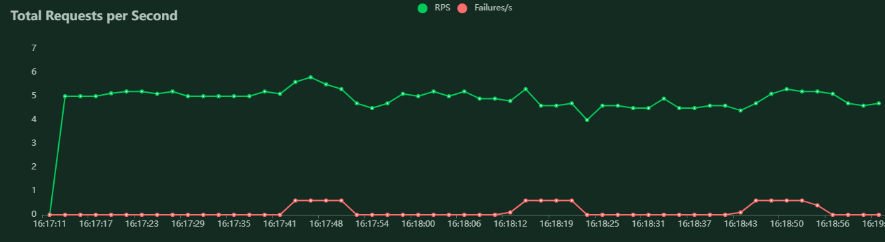
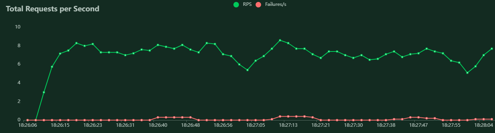

# REPORT

## Hardware specs - ThinkPad X280
```
Processor: Intel(R) Core(TM) i5-7300U CPU @ 2.60GHz, 3M Cache, up to 3.50 GHz (2 cores / 4 threads)
RAM: 8,00 GB
Integrated Graphic Processor: Intel(R) HD Graphics 620
OS: Windows 10 Pro 21H2
```

## Stress testing with *locust*

- peak concurrency: 50
- users started/second: 10
* all the load tests were execute for approximately 2 minutes

### TEST #1 - with 1 model

The predict method fails on 18 of the 432 requests, with an RPS of 3,8. The index method doesn't report any fails (132 requests) and has a RPS of 1,2. 

The global RPS is 4,9 with a 3% failures.




### TEST #2 - scaled with 3 models

The predict method fails on 11 of the 634 requests, with an RPS of 5,2. The index method doesn't report any fails (233 requests) and has a RPS of 1,9. 

The global RPS is 7,8 with a 1% failures.




### Conclusion

Scaling the model clearly improves the performance to processing request. Even though this improvement is not linear, it still makes a clear diference: almost twice as fast in global RPS and less then half of failures with almost 46% more of request processed. 