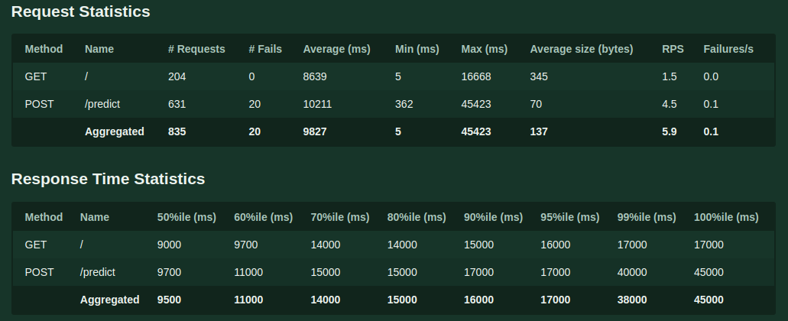
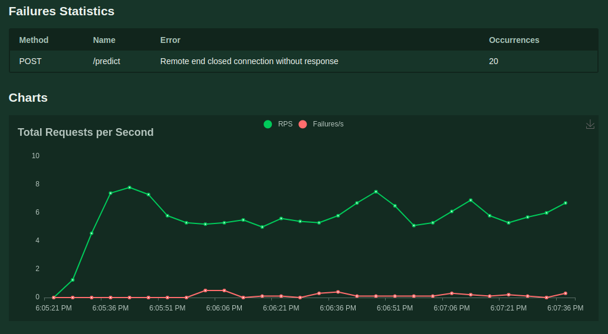
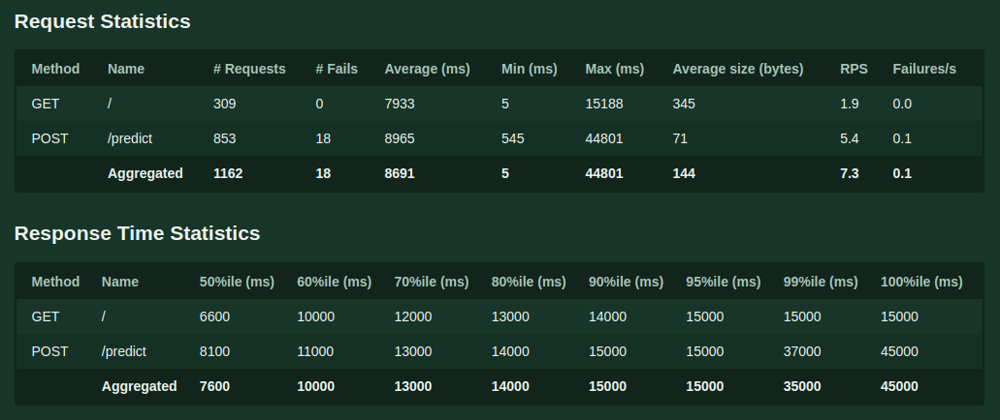
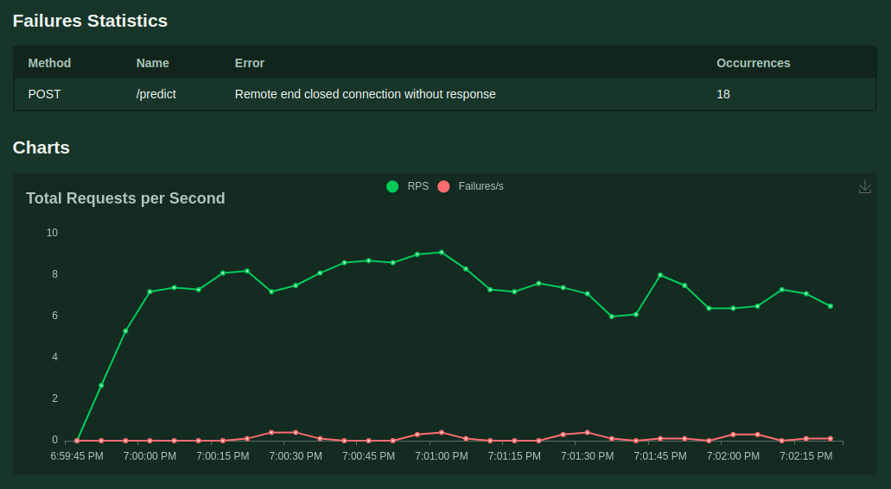
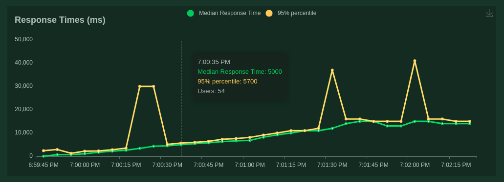

# REPORT OF THE STRESS TEST
## Computer specifications

CPU: Intel Core i5-7200U 2.50GHz × 4  
RAM: 8GiB  
DISK CAPACITY:1TB  

## First Report
N_models = 2  
Run_time = 2.5 mins  
N_users = 100

### Request and Response Time Statistics

### Request and Response Time Statistics

### Request and Response Time Statistics

## Second Report
N_models = 4  
Run_time = 2.5 mins  
N_users = 100

### Request and Response Time Statistics

### Request and Response Time Statistics

### Request and Response Time Statistics

## Conclusions

* There was a small difference between 2 and 4 containers of the model regarding to response time
* With 2 containers we had an rps of 5.9, and with 4 we had 7.3 rps
* In both cases they were around of 0.1% of failures, all of them corresponding to  timeouts