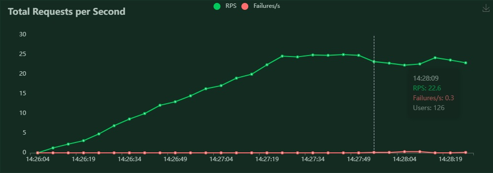
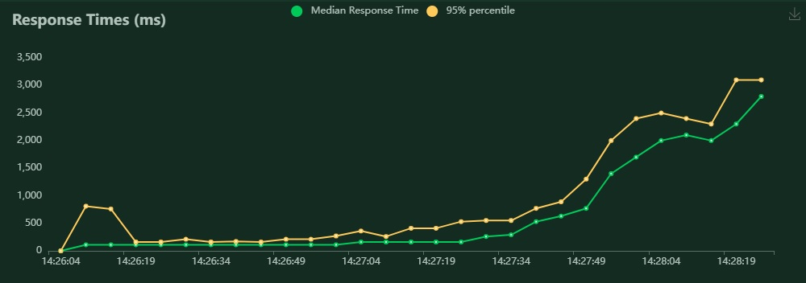

## This is my PC:
**Architecture** 
###         AMD Ryzen 5 5600G with Radeon Graphics, 6 cores, 12 thread.
---

## Locust with 1 model
### Parameters: 50 users, model never breaks
### RPS = 11 aprox.
### Cpu never work up than 35%
---

## Locust with 3 model
### Parameters: 500 users, model start with failures at 250 users aprox.
### RPS = 25 aprox.
### Cpu never work up than 80%

