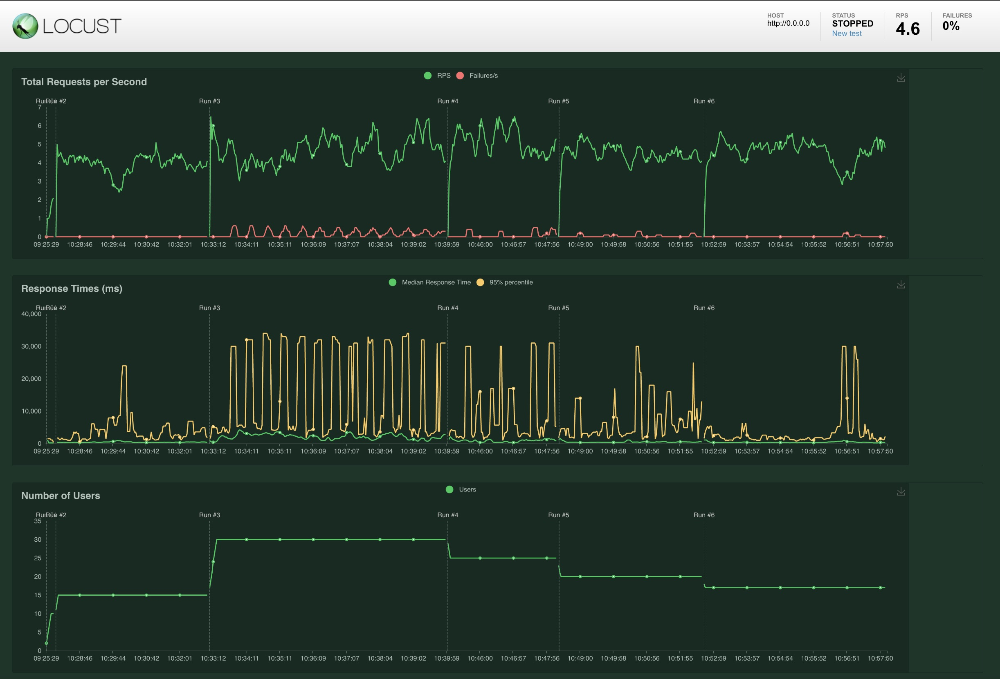
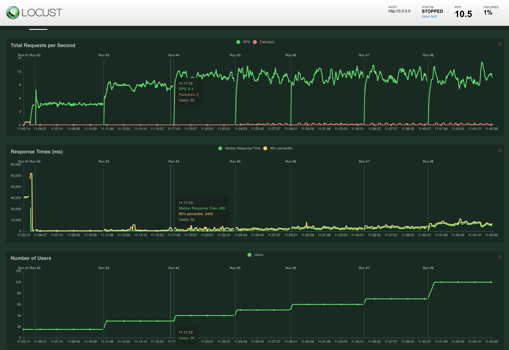

## Stress Test Report
In this test we try to simulate many users using these different endpoints (index and predict).
I use different weights for each endpoint, simulating that three times more people use /predict endpoint than index endpoint.
Without running any test the percentage of cpu used was around 80%.

In the first trial i simulate different number of users, trying to find the number of users that start to break the api. 
Here is a summary of that:

In this image we can see that with 15 users the service work well with 4 responses per second. Later in the second run with 30 users this started to break the api and saw more failures than before, with more time to get the response (the yellow peaks). In the other runs i continue decreasing the number of users until 17, however i never stop having some failure.
The percentage of cpu used in this case was around 200%. 

After that, i scaled the model service to 3 and got different results trying to see how many users started breaking the api.
Here is a summary of that:

In this case i started as before, but i didn't have any issue until the number of users reached 50. Trying to increase this number to simulate the same value of broken apis as before, only when the number reached 100 the results in number of failures were similar to the previous ones. But responses per second were more (10). And the percentage of cpu used in this case was around 400%.