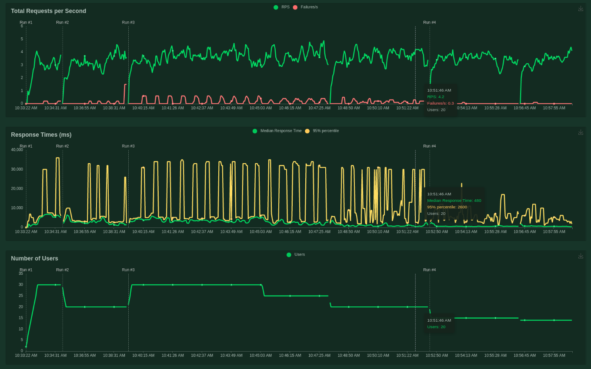
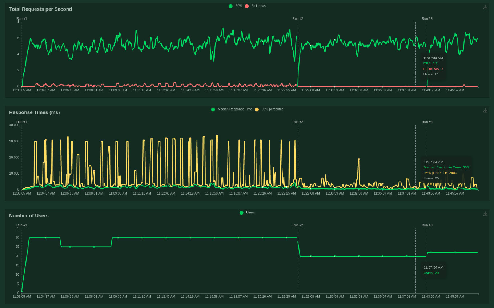

# Stress Tests with Locust

In order to know how robust is the application a stress test strategy was made.

The idea was to figure how many requests per second the application could handle. 

Two types of simulated requests were made: GET and POST. 

In the GET request only the index page was tested. In the POST request the **predict** function was tested with a fixed image. The requests were distributed randomly with a 3 to 1 proportion, meaning 75% of requests were POST and 25% GET. 

A sweep of number of users to expose the application to diferent levels of stress were made. Any given simulated user waited from 1 to 5 seconds to do a new request (after the previous was responsed). When a new amount of users were introduced into the system, the amount of active users was changed by a factor of 1.

The host where the tests were made has a CPU Intel i3 2.4Ghz x 4 with 8gb of RAM. *No GPU available.* 

## Stress Tests in the original architecture

As the following image shows the number of users tested were the following: 30, 20, 30, 25, 20, 15, 14.

When the application was tested with a number of users from 15 to 30, failures for time-out appeared. The most users the most failures. 
With 14 or less users the application could handle efectively all the requests. 

An average of 4 request per second (RPS) were achieved with this architecture.

## Stress Tests in the scaled architecture

To enhance the capability of the application in order to handle more requests, the model is replicated 3 times. 

A similar process was followed with this new architecure as the following image shows: 

As the previous image shows the number of users tested were the following: 30, 25, 30, 20, 22. Failures for time-out appeared with users from 22 to 30. For smaller amount of users all the request were well handled. 

An average of 5.7 RPS were achieved with this scaled architecture.

## Summary

With the scaled architecture an improvement in the amount of users the application could handle was obtained. From 14 to 20 users. 

The RPS was improved from 4 to 5.7 aproximately. 

Only a small improvement was obtained because of host did not has a GPU. 

