# Stress Test powered by LOCUST

## Install and run

Install the Locust library:

```
$ py -m pip install locust
```

Check you have build up the containers with docker compose and then 
run the service where the locustfile.py is located:

```
$ cd stress_test/
$ py -m locust
```

You should see something like this:

```
[2022-06-06 15:28:42,651] DESKTOP-0GQ5H5T/INFO/locust.main: Starting web interface at http://0.0.0.0:8089 (accepting connections from all network interfaces)
[2022-06-06 15:28:42,667] DESKTOP-0GQ5H5T/INFO/locust.main: Starting Locust 2.9.0

```
Now you are able to start the stress test.

To stop the service:

```
$ exit
```

## Stress Test

- Open your browser and reach the localhost & port url as mention in the locust service log. Enter values and press the start button.

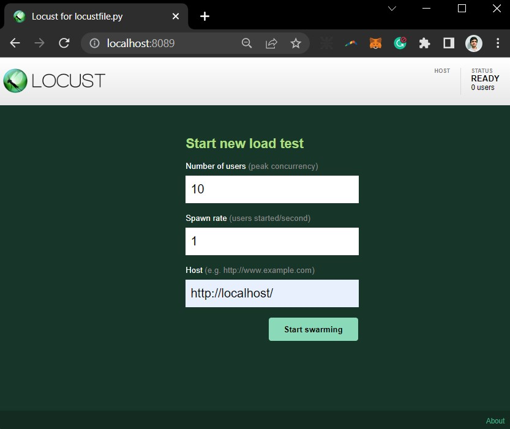

----

We are going to stress the model in **Run #1** with the following parameters ir order to compare performance 

```
-- scale model = [1, 3, 5]
```
 - 30 seconds per run
 - Number of users = [1, 2, 5, 10, 20]
 - Spawn rate = 1
 - _Stress test is set to make 3 post predict request per 1 get index request_

Then, we are adding **Run #2** in the scalated models

 * 60 seconds per run
 * Number of users = [20, 50, 100]
 * Spawn rate = 1 for [20, 50] & 2 for [100]

----

## Run #1
```
-- scale model = 1
```

Comments: The model performs as expected between 1 - 5 users. Up to 10 users, the 95% percentile response time starts to grow and rps reach a plateau. With 20 users median response time also grows, failures start to show up, and there isn't a rps improvement.

**Best mark rounds 6 rps**

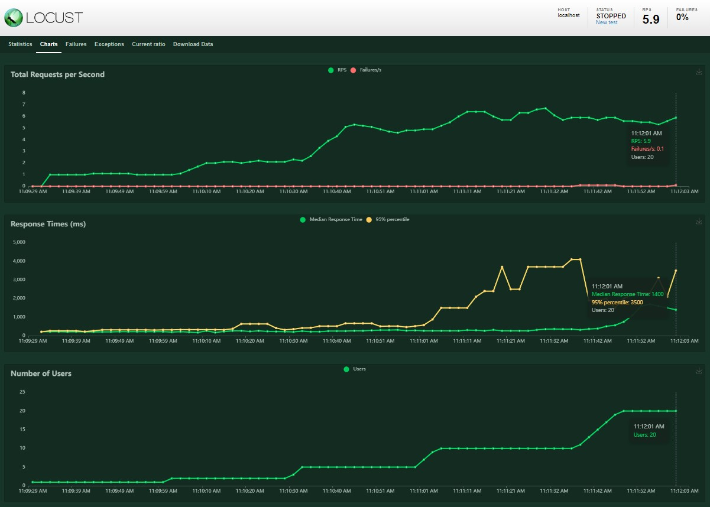

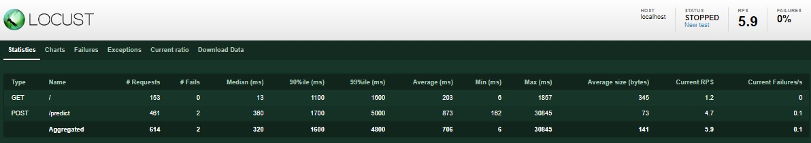


----
```
-- scale model = 3
```
Comments: A first tuning setup seems to appear in the first seconds due to a high response time. Rps increase when adding new users, from 10 users forward response time grew with it. No failures appear. 

**Best mark rounds 11 rps**

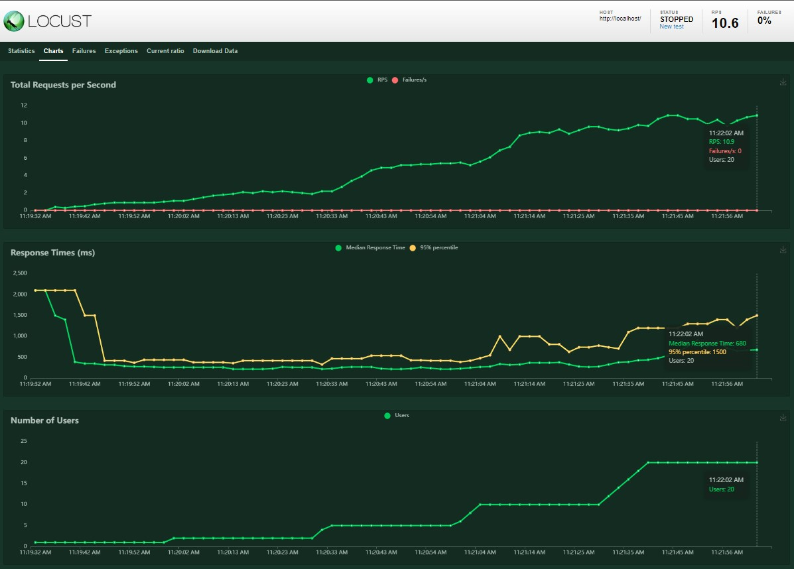

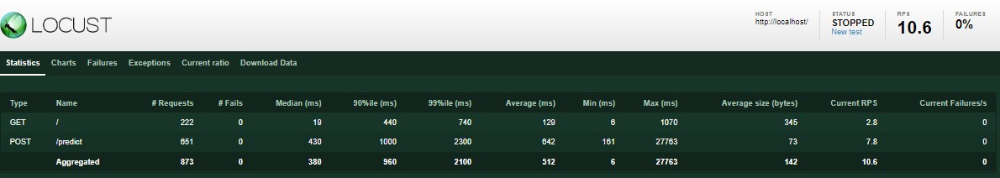


----
```
-- scale model = 5
```
Comments: Starting tuning is still showing up and it's bigger, probably due to container quantity growth. No difference detected with 3 models running.

**Best mark rounds 11 rps**

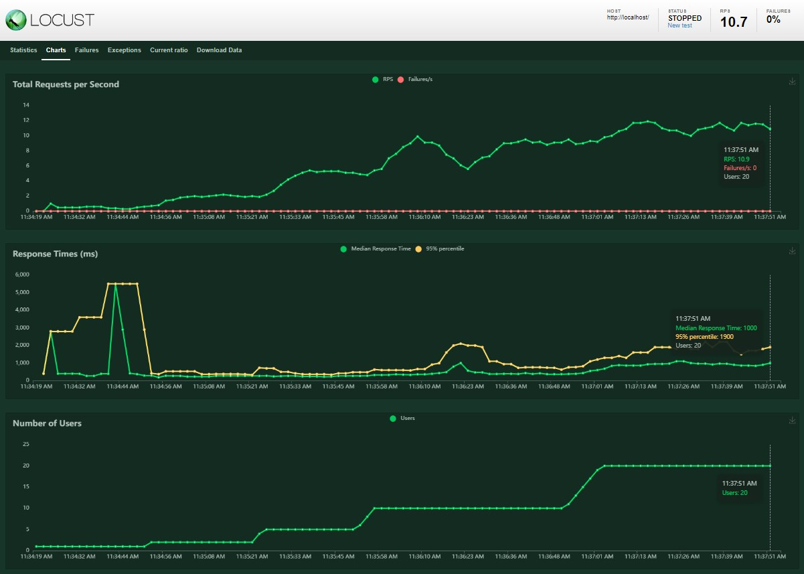

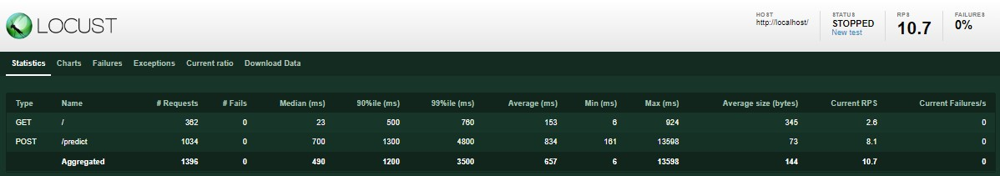


----

## Run #2
```
-- scale model = 3
```

Comments: Same rps performance as Run #1. The infrastructure supports 100 users simultaneously, put them in the queue, and waits until a model is free to process the request. Some failures appear and we noticed them as a timeout in the container log.

**Best mark rounds 11 rps**

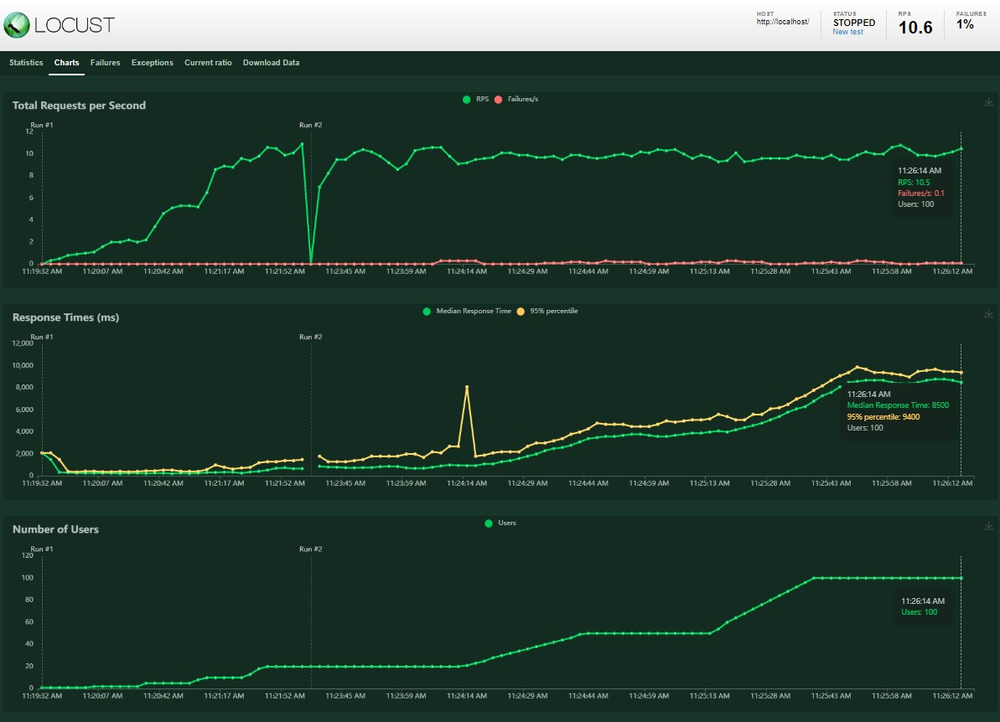

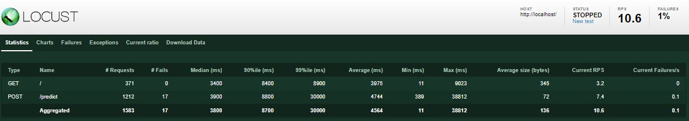

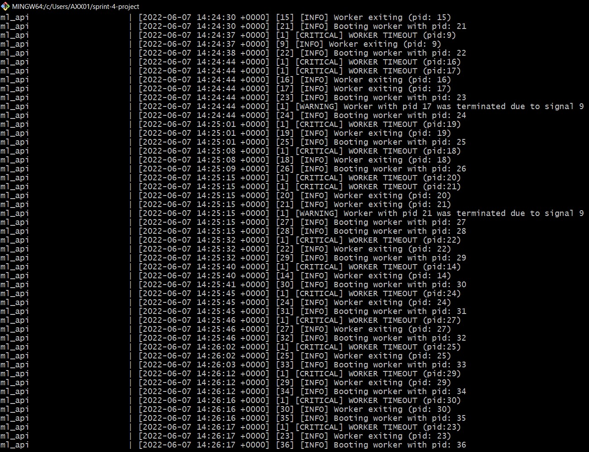


----
```
-- scale model = 5
```

Comments: Higher variance was detected in the rps and response time compared with 3 models running but same performance and results were achieved.

**Best mark rounds 11 rps**

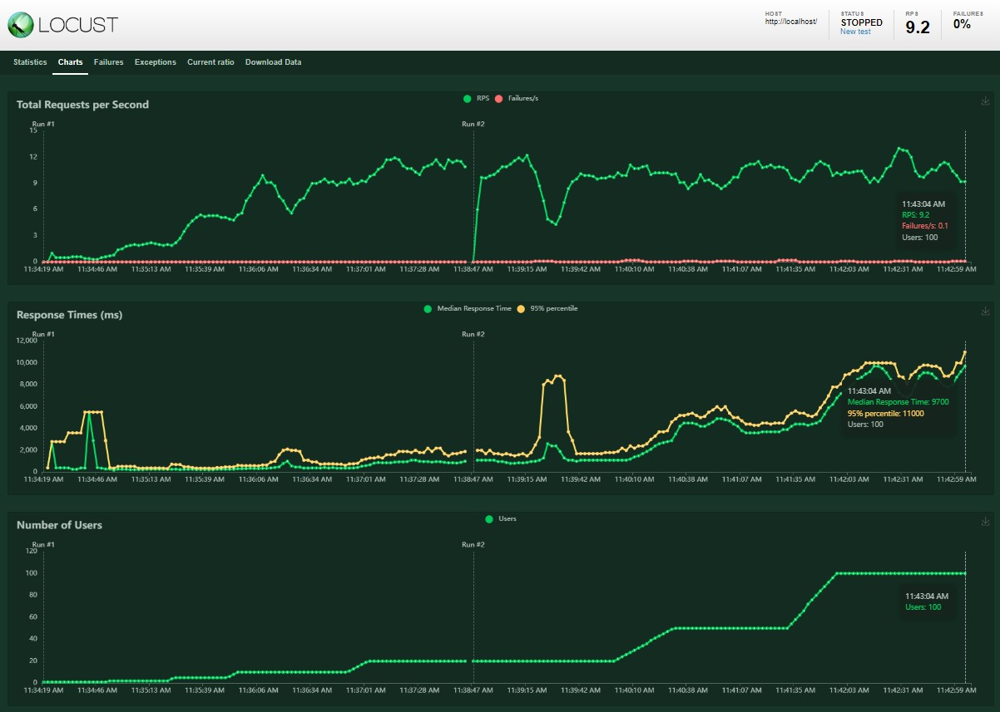

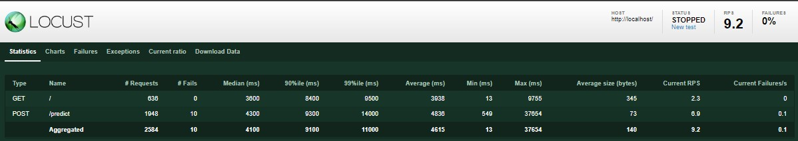

----
# Final conclusion

- Scaling the prediction model from 1 to 3 significantly increased the rps from 6 to 11 (+83%).
- Scaling from 3 to 5 did not get better results, the bottleneck has probably moved to the API.
- Increasing the number of users beyond 10 users did not increase the rps, but rather started to queue them and increase the wait times (most of the cases x10, and up to x50) as well as the failures appear.

Thanks for reading, happy learning

Rhemsy